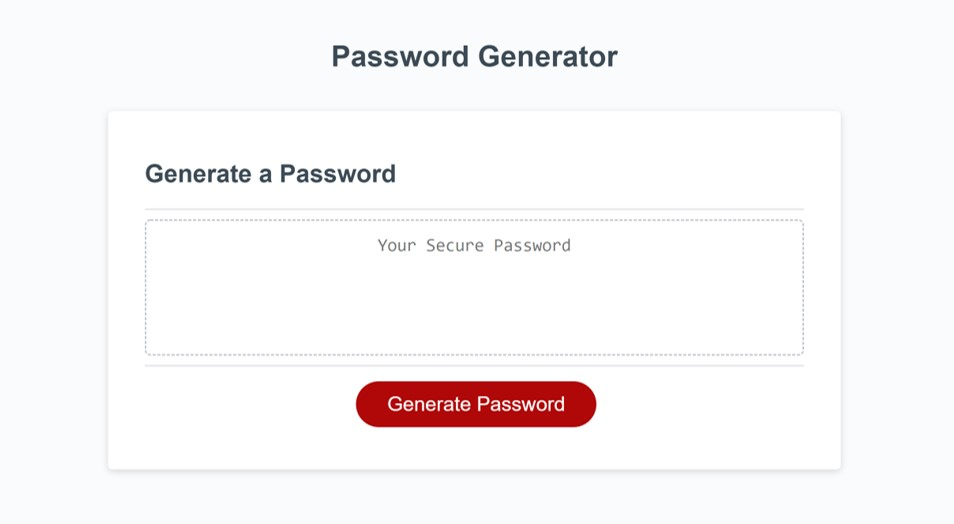
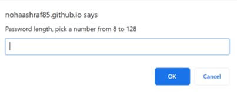
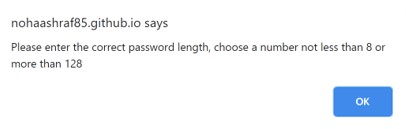
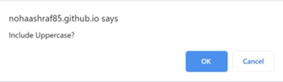
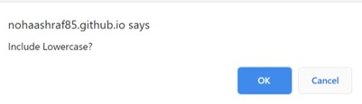
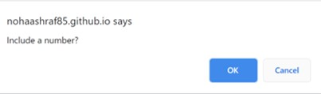
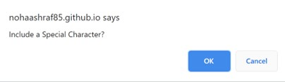
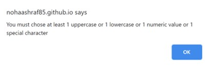
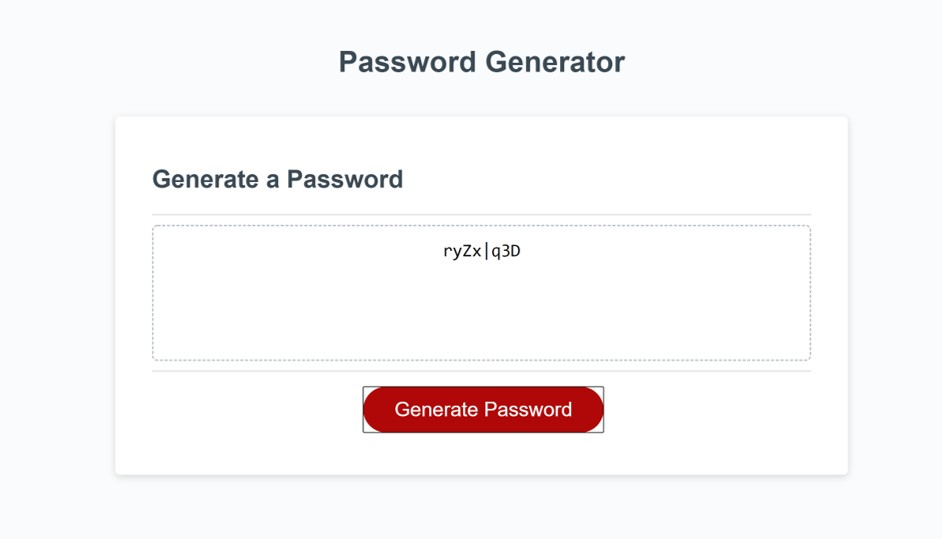

# Password Generator

This password generator was created as a part of my first attempt on javascript.

# Technologies Used:
1. HTML: to create the skeleton of the application (was provided by UCONN)
2. CSS: to style it (was provided by UCONN)
3. Javascript: to make the application come to live and do what it was intended to (Started Code was provided by UCONN)

# Project Objective:
This password generator is intended to provide the user with a strong password that includes:
1. A minimum of 8 characters and a maximum of 128 characters
2. A choice of the following:
    * Uppercase Characters
    * Lowercase Characters
    * Numbers
    * Special Characters

# How it works:
1. Accessing the application, the user is presented with a screen that includes an emptry space for the password to be generated and a button th actually generate the password
2. Upon clicking on the Generate Password button, the user is presented with a series of prompts
    * The user prompted to enter a value between 8 and 128 as a password length
        * if the user chooses a number less than 8 or greater than 128, the user is presented with the following alert **(Please enter the correct password length, choose a number not less than 8 or more than 128)** to adjust theri input within the range mentioned previously in the prompt
    * The user then has to press on the Generate Password button again to restart the first prompt, upon chosing the right range
    * the user is presented with a series of confirms to chose whether they want an uppercase, lowercase, number and/or a special character to be included
        * In case the user rejected all the above (pressed cancel) criteria, the user is presented with the following alert **(You must chose at least 1 uppercase or 1 lowercase or 1 numeric value or 1 special character)**
    * The user has to press on the GEnerate Password button again to repeat the whole cycle, upon meeting all the criteria, the password is then created.

    # How it looks like:
    ## Homepage:
    

    ## Password Length:
    

    ## Alert to chose correct password length:
    

    ## Include Uppercase:
    

    ## Include Lowercase:
    

    ## Include Number:
    
    
    ## Include Special Character:
    

    ## Alert in case the user did not choose (uppercase, lowercase,number and/or special character):
    

    ## Generated Password:
    

    